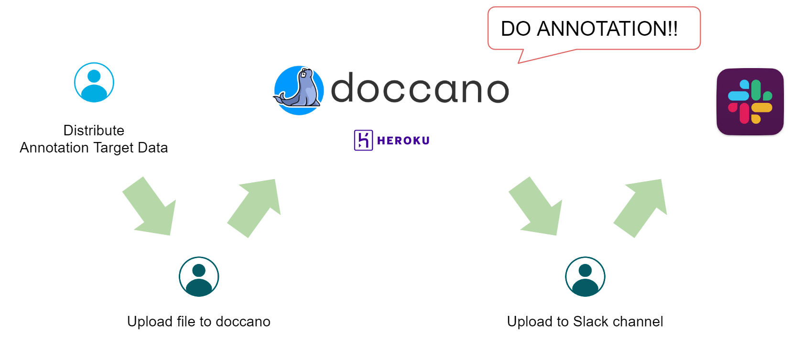
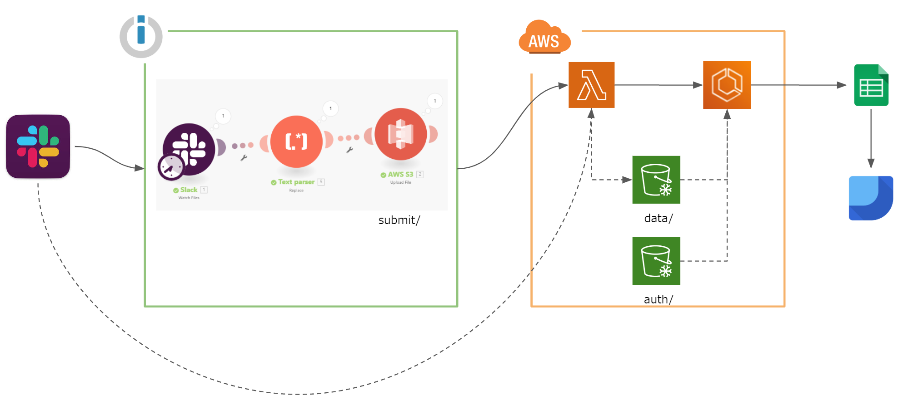

# YANS 2019: Annotation Hackathon

* [YANS 2019](http://yans.anlp.jp/entry/yans2019)

## Annotation Workflow

[Detail](https://docs.google.com/presentation/d/1x-hiXatyyRXEfnjiZU3S4zLdzCYT9XMNzq5wjtbxU58/edit#slide=id.p)

### Annotator Workflow

* You can easily deploy doccano by Heroku Button.
  * https://github.com/chakki-works/doccano
  * Recommendation: Use above hobby (for Heroku)/ hobby-basic (PostgreSQL) plan.

### Evaluation Backend

* S3 bucket: `yans.2019.js`
* Google book id: `1WDwojAFoswN_rBe0P31sKECcWeku25fgLtAG7ZSbAUo`
* Lambda function is triggerd by S3 upload. Lambda implementation is defined at `yans/function/lambda_function.py`.

### Resouces

* Slack => S3: [Integromat](https://www.integromat.com)
* Run Training: [AWS](https://console.aws.amazon.com/console)
  * Use [ECS](https://aws.amazon.com/jp/ecs/features/) to run Dockerfile
* Japanese NER model is based on [GiNZA](https://github.com/megagonlabs/ginza).

## Scripts

* Prepare data
  * Download and preprocess: `python yans/data/prepare.py`
* Train by data
  * `python yans/data/train.py`
  * If `--local` is set, use local `data` directory and else use S3.
* Evaluate model
  * `python yans/data/evaluate.py`
  * If `--local` is set, use local `data` directory and else use S3.
* Rule based annotation
  * `python yans/annotation/annotate.py`

## Result

* [Google Data studio Dashboard](https://datastudio.google.com/u/0/reporting/1nrzE6eXPYiT_fz4dYwp6W1QLcz6iUUKG/page/WgVy)
  * [Data source Spread Sheet](https://docs.google.com/spreadsheets/d/1WDwojAFoswN_rBe0P31sKECcWeku25fgLtAG7ZSbAUo/edit#gid=0)

